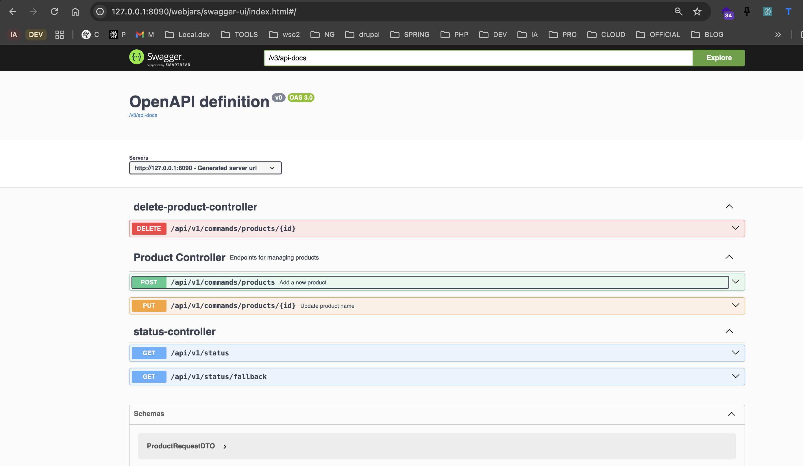

# spring-axon-rabbitmq-webflux-starter

This project is a **Spring Boot** application using **Axon Framework**, **RabbitMQ**, and **PostgreSQL**, following *
*DDD** (Domain-Driven Design) and **CQRS** (Command Query Responsibility Segregation) principles.

## 📥 Clone the Project

```sh
git clone https://github.com/coundia/spring-axon-rabbitmq-webflux-starter
cd spring-axon-rabbitmq-webflux-starter
```

## 📌 Prerequisites

Before running the application, make sure you have installed:

- [Docker](https://www.docker.com/)
- [Docker Compose](https://docs.docker.com/compose/)
- [Maven](https://maven.apache.org/)

## 🚀 Installation and Execution

### 1️⃣ Start PostgreSQL and RabbitMQ

Run the following command to start the Docker containers:

```sh
docker compose -f docker/main.yml up -d
```

### 2️⃣ Run Tests

```sh
mvn spring-boot:test-run
```

### 3️⃣ Start the Spring Boot Application

```sh
mvn spring-boot:run
```

## 📡 API Documentation

Once the application is running, you can access the **Swagger UI** documentation here:

http://127.0.0.1:8090/webjars/swagger-ui/index.html

## 📁 Project Structure

```
  ----------------------------------------------------------------
❰pcoundia❙~/projects/spring-axon-rabbitmq-webflux-starter(git✱✱➜main)❱✘≻ tree -L 7 src/
src/
├── main
│   ├── java
│   │   └── com
│   │       ├── generated
│   │       └── pcoundia
│   │           ├── ProductCommandApplication.java
│   │           ├── products
│   │           │   ├── application
│   │           │   │   ├── Mapper
│   │           │   │   ├── command
│   │           │   │   ├── dto
│   │           │   │   ├── event
│   │           │   │   ├── projections
│   │           │   │   ├── query
│   │           │   │   └── queryHandler
│   │           │   ├── domain
│   │           │   │   ├── aggregate
│   │           │   │   ├── exception
│   │           │   │   ├── useCase
│   │           │   │   └── valueObject
│   │           │   ├── infrastructure
│   │           │   │   ├── entity
│   │           │   │   └── repository
│   │           │   └── presentation
│   │           │       └── controller
│   │           └── shared
│   │               ├── Presentation
│   │               │   └── StatusController.java
│   │               └── infrastructure
│   │                   ├── axon
│   │                   ├── config
│   │                   ├── exception
│   │                   ├── mongodb
│   │                   ├── rabbitMq
│   │                   └── security
│   └── resources
│       ├── application-test.properties
│       ├── application.properties
│       ├── schema-axon.sql
│       └── schema-domain.sql
└── test
    └── java
        └── com
            └── pcoundia
                ├── ProductCommandApplicationTests.java
                ├── infrastructure
                │   └── controller
                │       ├── AddProductControllerTest.java
                │       ├── DeleteProductControllerTest.java
                │       ├── StatusControllerTest.java
                │       └── UpdateProductNameProductControllerTests.java
                └── shared
                    ├── BaseIntegrationTests.java
                    └── BaseUnitTests.java

42 directories, 13 files
       
```
# 🚀 API  Documentation Swagger UI


## 🔹 Notes

- The application follows the **CQRS pattern**, separating command and query models.
- **RabbitMQ** is used as a **message broker** for event-driven communication.
- **PostgreSQL** is the primary database.

## 📜 License

CC-BY-NC-SA-4.0
